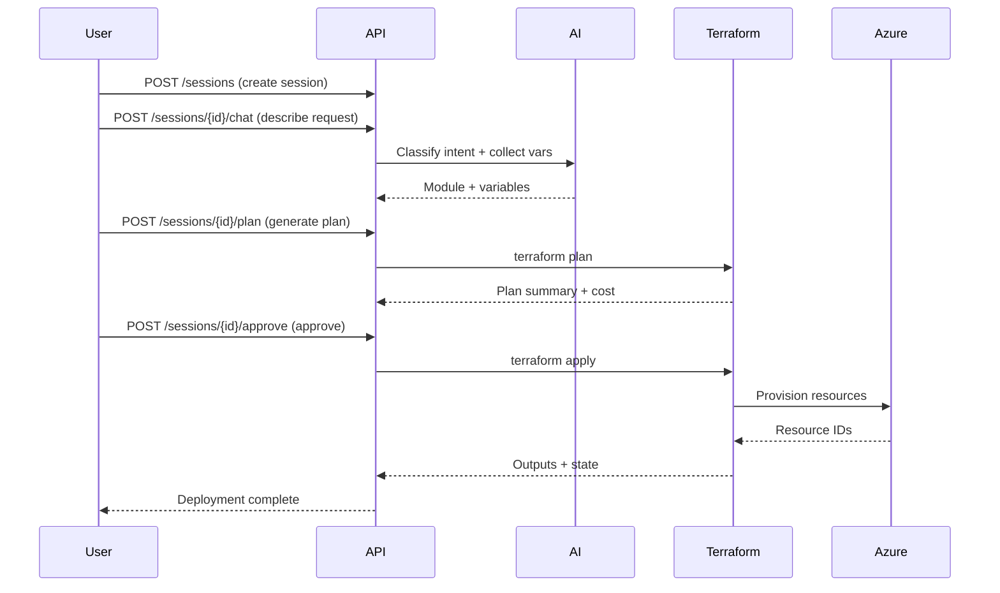

# InfraGenie — AI Automation Platform

Intelligent infrastructure provisioning powered by AI. InfraGenie bridges natural language conversations with Terraform-based cloud deployments, ServiceNow ITSM integration, and cost estimation via Infracost.

## Architecture

```
┌─────────────────────────────────────────────────────┐
│                    Frontend (React)                  │
│             Port 3000  ·  Docker Compose             │
└──────────────────┬──────────────────────────────────┘
                   │ HTTP
┌──────────────────▼──────────────────────────────────┐
│                 Backend (FastAPI)                    │
│              Port 8000  ·  Python 3.11               │
│                                                      │
│  ┌────────────┐  ┌──────────┐  ┌─────────────────┐  │
│  │Provisioning│  │  ITSM    │  │  Cost Estimation│  │
│  │   Agent    │  │   Chat   │  │  (Infracost)    │  │
│  └────────────┘  └──────────┘  └─────────────────┘  │
│                                                      │
│  ┌────────────┐  ┌──────────┐  ┌─────────────────┐  │
│  │ Terraform  │  │ServiceNow│  │  Azure Blob     │  │
│  │  Runtime   │  │  Sync    │  │  Storage        │  │
│  └────────────┘  └──────────┘  └─────────────────┘  │
└──────────────────┬──────────────────────────────────┘
                   │
    ┌──────────────┼──────────────┐
    ▼              ▼              ▼
┌────────┐  ┌──────────┐  ┌────────────┐
│ Azure  │  │ServiceNow│  │  Azure     │
│  RM    │  │  ITSM    │  │  Blob      │
└────────┘  └──────────┘  └────────────┘
```

### Components

| Service        | Technology    | Port  | Description                              |
|----------------|---------------|-------|------------------------------------------|
| Backend API    | FastAPI       | 8000  | REST API + WebSocket for AI provisioning |
| Frontend       | React         | 3000  | Dashboard UI for all features            |
| MongoDB        | MongoDB 7     | 27017 | Sessions, tickets, user config           |
| Redis          | Redis 7       | 6379  | Caching, rate limiting                   |

## Features

- **AI-Powered Provisioning** — Natural language to Terraform. Tell the AI what you want and it generates, plans, and deploys infrastructure.
- **Multi-Module Catalog** — Virtual Machines, Resource Groups, Virtual Networks, and more.
- **Cost Estimation** — Infracost integration shows monthly cost before you deploy.
- **ITSM Chat Agent** — Conversational interface to create, list, and track ServiceNow tickets.
- **ServiceNow Sync** — Every deployment creates a synchronized ServiceNow incident with watchers.
- **Azure Blob Artifacts** — Terraform plans, state files, and outputs stored in Azure Blob Storage with human-readable paths.
- **Session History** — Full audit trail of conversations, plans, approvals, and deployments.

## Getting Started

### Prerequisites

- Docker & Docker Compose
- Azure subscription with Service Principal
- (Optional) ServiceNow instance for ITSM integration
- (Optional) Infracot CLI token for cost estimation

### Quick Start

```bash
# Clone the repository
git clone https://github.com/HP04Harsh/infraGenie---AI-Automation-Platform.git
cd infraGenie---AI-Automation-Platform

# Configure environment variables
cp backend/.env.example backend/.env
# Edit backend/.env with your Azure credentials

# Start all services
docker compose up -d

# Access the dashboard
open http://localhost:3000
```

### Default Credentials

| Role  | Email               | Password     |
|-------|---------------------|--------------|
| Guest | guest@infragenie.io | Guest@321    |
| Admin | _(set up via UI)_   | _(set up)_   |

## Authentication

InfraGenie uses JWT-based authentication with cookie storage.

### User Registration

```http
POST /api/auth/register
Content-Type: application/json

{
  "email": "user@example.com",
  "password": "yourpassword",
  "name": "Your Name"
}
```

### Login

```http
POST /api/auth/login
Content-Type: application/json

{
  "email": "user@example.com",
  "password": "yourpassword"
}
```

Response sets an `ig_token` cookie (valid 24h). All subsequent API calls use this cookie for authentication.

### Profile

```http
GET /api/auth/me
Cookie: ig_token=<token>
```

## API Overview

### Infrastructure Provisioning

Endpoints are under `/api/provisioning/`.



### ITSM Chat

```http
POST /api/itsm/chat
Cookie: ig_token=<token>
Content-Type: application/json

{
  "message": "create a ticket for database server down"
}
```

### Tickets

```http
GET /api/tickets
POST /api/tickets/{id}/comment
POST /api/tickets/{id}/approve
POST /api/tickets/{id}/reject
```

## Configuration

### Portal Settings (UI)

Configure these from the Settings page (no env vars needed):

- **Azure Tenant**: Tenant ID, Subscription ID, Client ID, Client Secret
- **Azure OpenAI**: Endpoint, API Key, Deployment name
- **ServiceNow**: Instance URL, Username, Password
- **Terraform Storage**: Azure Storage Account, Container, Access Key

### Environment Variables

| Variable             | Description                    | Required |
|----------------------|--------------------------------|----------|
| `MONGO_URL`          | MongoDB connection string      | Yes      |
| `DB_NAME`            | Database name                  | Yes      |
| `JWT_SECRET`         | JWT signing secret             | Yes      |
| `CORS_ORIGINS`       | Allowed CORS origins           | Yes      |
| `REDIS_URL`          | Redis connection string        | Yes      |

## Terraform Modules

Built-in modules in `terraform/modules/`:

| Module                  | Description                          |
|-------------------------|--------------------------------------|
| `resource-group`        | Azure Resource Group                 |
| `virtual-machine`       | Linux Virtual Machine                |
| `virtual-machine-windows` | Windows Virtual Machine             |
| `virtual-network`      | Virtual Network with subnets         |
| `storage-account`      | Azure Storage Account                |
| `app-service`          | App Service Plan + Web App           |

## Blob Storage Artifacts

Terraform artifacts are uploaded to Azure Blob Storage with the following path structure:

```
{prefix}/{workspace_id}/{resource_name}-{deployment_id_short}/{file}
```

Example: `infragenie/bc22a3b5-.../server01-c07235ef/terraform.tfvars`

## Development

### Backend

```bash
# Run tests inside container
docker exec infragenie-backend python3 -m pytest

# Watch logs
docker compose logs -f backend
```

### Frontend

```bash
cd frontend
npm install
npm run dev
```

## Deployment

InfraGenie runs entirely via Docker Compose. For production:

1. Set strong `JWT_SECRET` and `MONGO_URL` in `.env`
2. Configure `CORS_ORIGINS` to your domain
3. Use a reverse proxy (nginx/traefik) with HTTPS termination
4. Set up MongoDB backups
5. Pin Docker image versions in `docker-compose.yml`

## Screenshots

> Coming soon

---

**Author**: Harsh Pardhi

## License

MIT
